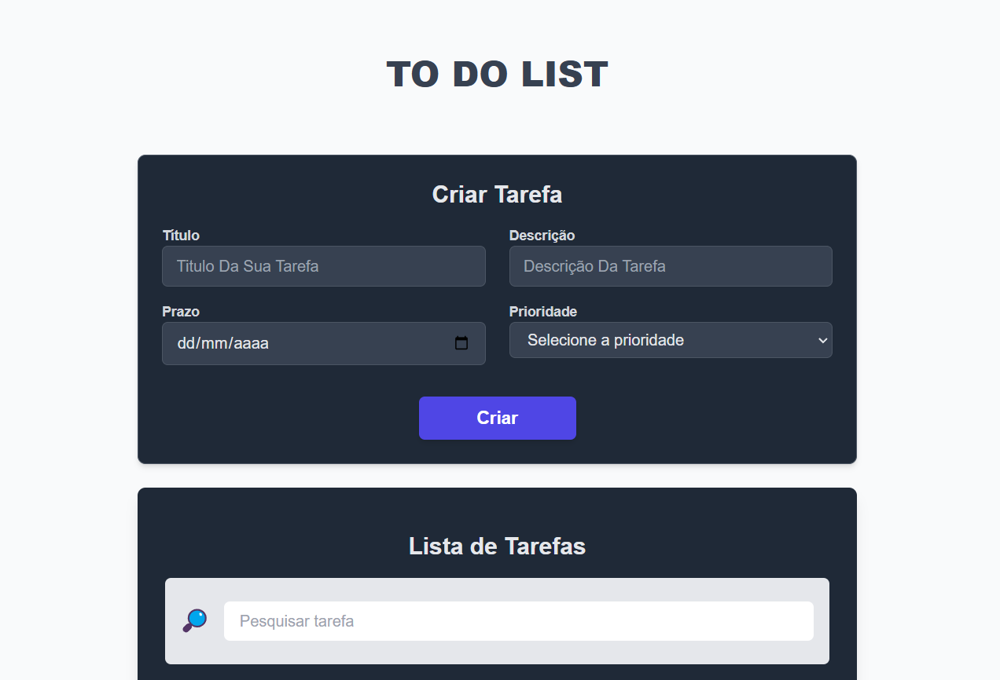

# 📌 Sistema de Gestão de Tarefas

Bem-vindo ao **Sistema de Gestão de Tarefas**, uma aplicação desenvolvida com **Nuxt.js 3** e **Pinia** para gerenciar suas tarefas de forma simples e eficiente.

## Imagem do projeto



## 🛠 Tecnologias Utilizadas

- **Nuxt.js 3** - Framework Vue.js para aplicações SSR e SPA
- **Pinia** - Gerenciamento de estado
- **TailwindCSS** - Estilização responsiva
- **TypeScript** - Tipagem segura e padronização do código
- **VueUse** - Conjunto de utilitários para Vue.js
- **Auto Animate** - Animações automáticas para listas dinâmicas

## 📋 Funcionalidades

✅ Criar, editar e excluir tarefas  
✅ Pesquisar tarefas  
✅ Persistência de dados com **LocalStorage**  
✅ Interface responsiva e intuitiva  
✅ Animações suaves ao adicionar ou remover tarefas

## 🚀 Requisitos

Antes de iniciar, certifique-se de ter instalado:

- **Node.js** (versão 16 ou superior)
- **Gerenciador de pacotes** (npm ou yarn)

## 📦 Instalação

Clone o repositório e instale as dependências:

```bash
# Clone o repositório
git clone https://github.com/lucasscabral/teste_tecnico_eslab

# Entre na pasta do projeto
cd teste_tecnico_eslab

# Instale as dependências
npm install
```

## ▶️ Executando o Projeto

Para rodar o projeto em ambiente de desenvolvimento, execute:

```bash
npm run dev
```

O servidor iniciará em [http://localhost:3000](http://localhost:3000).

## 🏗 Estrutura do Projeto

```
├── components/         # Componentes reutilizáveis
│   ├── Task.vue        # Componente para exibir tarefas
│   ├── SearchAndFilterTask.vue  # Barra de pesquisa e filtros
│   ├── ListTasks.vue    # Componente para listar tarefas
│   └── CreateTask.vue  # Componente para criar novas tarefas
├── layouts/            # Layouts da aplicação
│   ├── default.vue     # Layout padrão
├── composables/       # Funções auxiliares
│   ├── useValidationForm.ts  # Validação de formulários
├── interfaces/       # Tipos e interfaces
│   ├── task.ts         # Interface para tarefas
├── plugins/           # Plugins do Nuxt.js
│   ├── toast.ts       # Plugin de notificações
├── pages/              # Páginas principais da aplicação
│   ├── index.vue       # Tela inicial com a lista de tarefas
├── stores/             # Gerenciamento de estado com Pinia
│   ├── task.ts    # Store de tarefas
├── assets/             # Estilos
├── app.vue             # Componente principal da aplicação
├── nuxt.config.ts      # Configurações do Nuxt.js
└── package.json        # Dependências e scripts
```

## 🎨 Estilização

O projeto utiliza **TailwindCSS** para estilização. O arquivo principal de estilos pode ser encontrado em:

```
assets/css/main.css
```

## 📝 Considerações Finais

Este projeto foi desenvolvido como parte de um teste técnico para a empresa EsLab. A aplicação é uma demonstração de como utilizar Nuxt.js 3, Pinia, TailwindCSS e VueUse para criar uma aplicação web moderna e responsiva de gestão de tarefas.
